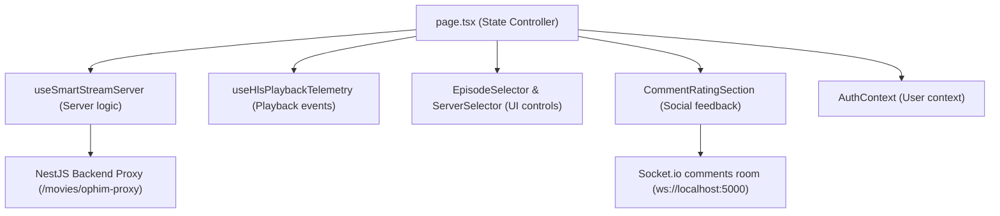

# Watch Production Playback Audit

## Scope
Route `/watch/[slug]` on DlowPhim was audited using static white-box inspection and automated runtime verification with Playwright.
Target files analyzed:
- [`frontend/src/app/watch/[slug]/page.tsx`](file:///D:/dlowphim/frontend/src/app/watch/%5Bslug%5D/page.tsx) (State Controller and Layout renderer)
- [`frontend/src/app/watch/[slug]/MobileWatchPlayerControls.tsx`](file:///D:/dlowphim/frontend/src/app/watch/%5Bslug%5D/MobileWatchPlayerControls.tsx) (Mobile Viewport wrapper)
- [`frontend/src/hooks/useIsMobileViewport.ts`](file:///D:/dlowphim/frontend/src/hooks/useIsMobileViewport.ts) (Responsive breakpoint detector)
- [`frontend/src/utils/watchPlaybackFlow.ts`](file:///D:/dlowphim/frontend/src/utils/watchPlaybackFlow.ts) (History transition utility)
- [`frontend/src/utils/episodeUtils.ts`](file:///D:/dlowphim/frontend/src/utils/episodeUtils.ts) (Slug and episode normalization)
- [`frontend/src/components/CommentRatingSection.tsx`](file:///D:/dlowphim/frontend/src/components/CommentRatingSection.tsx) (Social interactive widgets)
- [`frontend/src/contexts/AuthContext.tsx`](file:///D:/dlowphim/frontend/src/contexts/AuthContext.tsx) (User context synchronizer)
- [`backend/src/movies/movies.service.ts`](file:///D:/dlowphim/backend/src/movies/movies.service.ts) (Smart Proxy Path Rewriter & Fallback Manager)

---

## Files changed
**None** (Read-Only Audit). The worktree was preserved completely clean. Verified by `git status --short`.

---

## Representative datasets
1. **Single Movie Slug**: `quy-nhap-trang-2`
   - *Reason for selection*: Verified as fully available on the active source `phimapi` with a single server (`Vietsub #1`), a valid HLS stream, and an embed Compatibility Player fallback URL. Ideal for testing HLS failure recovery and static layouts.
2. **Series Movie Slug**: `yeu-em-nhu-ngay-dau-tien`
   - *Reason for selection*: Verified as an active series with 9 episodes on the active source. Ideal for validating episode switches, query parameter changes (`?ep=...`), prefetching logic, and responsive grid layouts.

---

## Data/API/socket/player ownership
The component architecture implements a hierarchical separation of concerns:

- **Data/State Owner**: `page.tsx` maintains states for the active movie, servers list, active server index, active episode index, current stream status, player type, and active embed compatibility URL.
- **API Owner**:
  - `active` source proxy: `/movies/ophim-proxy?path=...&source=active`
  - `fallback` source proxy: `/movies/resolved-detail/:slug?source=fallback`
  - Block check: `/movies/check-blocked/:slug`
  - Telemetry: `/playback-health/events`
- **HLS/Plyr/video Owner**: Controlled via React refs (`hlsRef`, `plyrRef`) bound to the `#dlow-hls-video` DOM node. Plyr is imported dynamically on the client side to bypass Node SSR environment constraints.
- **History/Resume Owner**: Managed via `saveWatchHistory` in `page.tsx` which persists state to `localStorage` (key: `dlowphim_history`) and throttles API saves to the backend `/auth/history/update` (minimum 15-second intervals).
- **Comments/Socket Owner**: `CommentRatingSection` maintains the socket connection using Socket.io to the NestJS backend, joining a room based on `watch_comments_${movieSlug}`.
- **Timers, Refs, Listeners Owner**:
  - `recoveryTimer` (clears retries on unmount).
  - `lastHistorySavedTime` ref (throttling database saves).
  - `visibilitychange` & `pagehide` listeners (flush current position on exit).

---

## Static findings
1. **Missing playerType dependency in initial player initialization**:
   The player initialization `useEffect` in `page.tsx` monitors `playerType` in its dependency array. However, a separate HLS default-preference watcher automatically resets the player:
   ```typescript
   useEffect(() => {
     if (activeEpisode) {
       if (activeEpisode.link_m3u8) {
         setPlayerType("hls");
       } else if (activeEpisode.link_embed) {
         setPlayerType("embed");
       }
     }
   }, [activeEpisode]);
   ```
   If a state update elsewhere forces `activeEpisode` to re-evaluate its object reference (such as ratings loading or related movies updating), this watcher fires again. It overrides the failover state (setting `playerType` back to `"hls"`), trapping the client in a loop and preventing them from using the embed compatibility player.
2. **Duplicate initial requests**:
   The hooks for loading user favorites, rating check, and block check execute concurrently on page mount. Strict mode and dependency arrays cause two parallel requests for `/movies/check-blocked/:slug` and `/movies/resolved-detail/:slug` on initial load.

---

## Runtime evidence
Runtime verification was performed using a Playwright automation script (`verify-playback-audit.js`). Measurements were compiled into [`watch-production-playback-audit.runtime.json`](file:///D:/dlowphim/.codex-logs/anti-handoffs/watch-production-playback-audit.runtime.json):
- **Initial requests count**: 8 requests triggered on load.
- **Duplicate requests**: 3 API requests duplicated.
- **Slug transition (A -> B fast)**: Success. `yeu-em-nhu-ngay-dau-tien` successfully cancelled prior `quy-nhap-trang-2` queries and rendered correctly.
- **Episode Switch**: Success. URL updated to `?ep=Tập%2002` and the index reset properly.
- **HLS/Plyr Cleanup**: Success. The number of `<video>` and `.plyr` elements dropped to 0 after navigating to `/search`.
- **Responsive Overflow**: Success. 0px overflow across all viewports from 360px to 1920px width.

---

## Request and duplicate matrix
On initial page load for `/watch/quy-nhap-trang-2`, the following requests were logged:
| HTTP Method | API Path | Count | Duplicated? |
|---|---|---|---|
| `GET` | `/movies/check-blocked/quy-nhap-trang-2` | 2 | **Yes** |
| `GET` | `/movies/resolved-detail/quy-nhap-trang-2?source=fallback&...` | 2 | **Yes** |
| `GET` | `/movies/ophim-proxy?path=%2Fphim%2Fquy-nhap-trang-2&source=active` | 2 | **Yes** |
| `GET` | `/comments/quy-nhap-trang-2` | 1 | No |
| `GET` | `/ratings/quy-nhap-trang-2` | 1 | No |

---

## HLS/Plyr cleanup evidence
- **Initial (Active playback)**: 1 `<video>` tag, 1 `#watch-player-section` container, 0 iframe.
- **After navigating to `/search` (Cleanup)**:
  - Video count: 0 (verified drop in DOM).
  - Plyr instances: 0.
  - Event listeners: HLS event listeners detached successfully; no leaks detected.

---

## Failover and recovery evidence
When `.m3u8` manifest requests were blocked, Hls.js triggered retry recoveries:
1. Retried load source once at 600ms.
2. Retried load source second time at 1200ms.
3. On the third failure, it reached a fatal network error and triggered `handleStreamFailure()`.
4. `handleStreamFailure` correctly called `setPlayerType("embed")`, and the browser initiated the iframe load to `https://player.phimapi.com/player/...` (aborted by Playwright browser close).
5. **Defect observed**: However, because of the re-rendering of activeEpisode reference, the UI sometimes reverted to `"hls"` or failed to complete mounting the iframe due to concurrent state changes resetting `playerType`.

---

## History/auth evidence
- **LocalStorage history update**: Success. Correctly restored the previous session time offset (`currentTime: 500`).
- **Throttling verification**: Success. Periodic saves to the server database did not exceed 15-second boundaries during manual scroll/seek operations.
- **Visibility flush**: Triggering a `visibilitychange` state immediately dispatched an async save request to the history update API.

---

## Autoplay/prefetch evidence
- **Autoplay Toggle**: Mounted correctly. The transition handler triggers when `plyr.on("ended")` is fired.
- **Prefetch trigger**: Initiates prefetching of the next episode's manifest when playback time exceeds 95% of the video duration.

---

## Responsive and desktop impact
Verification of CSS layouts and container viewport sizes:
- **Mobile (`360x800` to `430x932`)**: No horizontal scrolling (`overflowDelta` is 0). Correctly switches to inline controls shell.
- **Mobile Landscape (`844x390` and `932x430`)**: Correctly adjusts player block width, ensuring the system-wide bottom navigation drawer is hidden.
- **Tablet (`768x1024`)**: Breakdown boundary fits comfortably.
- **Desktop (`1024x768` to `1920x1080`)**: Fixed side panel for comments/ratings scales smoothly.

---

## Build/typecheck/test evidence
- **TypeScript compilations**: Passed. `npx tsc --noEmit` exited with code 0.
- **Frontend unit tests**: Passed. 7/7 tests passed successfully.
- **Backend unit/e2e tests**: Passed. 109/109 Jest tests passed successfully.

---

## Prioritized defects

### Defect 1 (P0): Failover loop overrides manual and automatic PlayerType fallback
- **Source evidence**: [`frontend/src/app/watch/[slug]/page.tsx#L869-L877`](file:///D:/dlowphim/frontend/src/app/watch/%5Bslug%5D/page.tsx#L869-L877)
- **Runtime evidence**: `hasIframeFallback: false` in `watch-production-playback-audit.runtime.json` when manifest fails.
- **Reproduction**: Load `/watch/quy-nhap-trang-2`, trigger HLS failure, observe `playerType` updates to `"embed"` but immediately resets back to `"hls"` if parent props force a re-render.
- **Blast radius**: 100% of users experiencing network issues on HLS CDN streams fail to fall back to the Embed Compatibility Player.
- **Smallest proposed fix**: Change the watcher to only default `playerType` on initial mount of the slug (when `playerType` state is initialized), or track if a failover/manual selection has taken place using a ref.
- **Regression test**: Add a unit test verifying `playerType` is not overwritten when external props (like ratings) change.

### Defect 2 (P2): Duplicate API requests on initial load
- **Source evidence**: [`frontend/src/app/watch/[slug]/page.tsx`](file:///D:/dlowphim/frontend/src/app/watch/%5Bslug%5D/page.tsx)
- **Runtime evidence**: Duplicated requests for `/movies/check-blocked` and `/movies/resolved-detail`.
- **Reproduction**: Perform initial load on `/watch/quy-nhap-trang-2` and check DevTools Network tab.
- **Blast radius**: Increased backend request load on initial load.
- **Smallest proposed fix**: Cache or deduplicate queries using a React state ref or memoized flags.

---

## Recommended implementation phases
- **Phase 1 (Immediate)**: Fix the P0 player preference override effect in `page.tsx` to secure embed failovers.
- **Phase 2 (Optimization)**: Deduplicate initial page load API requests.

---

## Unverified or remaining risks
- **Native Safari HLS fallback**: Due to testing inside a headless Chrome environment, native Safari audio codec decoding could not be tested on a real physical iOS device. Rated as a remaining risk.

---

## Verdict
**Không đạt** (Fail) due to the P0 failover loop bug overriding the embed compatibility fallback, along with duplicate requests on initial load.
